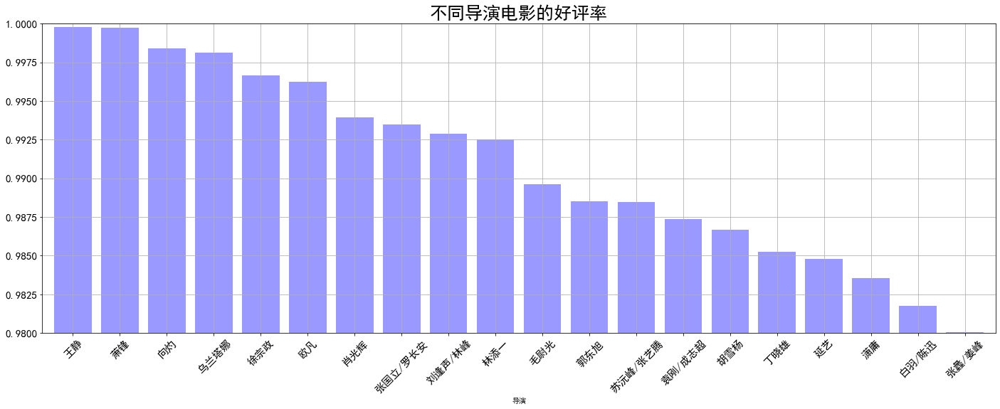
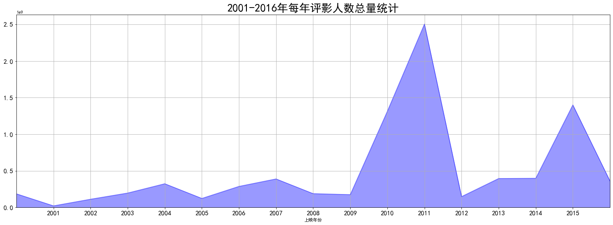
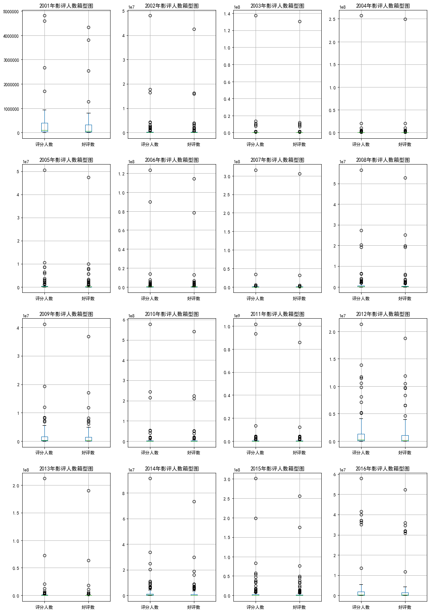

# 【网易云课堂AI工程师】电影数据处理及分析

## Introduction(项目介绍)

This project is one of the practical projects of AI Engineer (computer vision) in Netease cloud classroom. Through the comprehensive application of pandas, numpy and Matplotlib, the movie data samples of a movie website are comprehensively analyzed. Through the practical training of this project, we can further master some common libraries and related methods of Python.

本项目为网易云课堂AI工程师(计算机视觉)实战项目之一，通过pandas、numpy及matplotlib的综合运用，对某电影网站的电影数据样本进行综合分析。通过该项目的实战训练，达到对python的一些常用库及相关方法的进一步掌握。

## Requirements(项目要求)

1. Data cleaning
 1.1Remove null value
 1.2Change time field to time tag

2. Favorable rate statistics 
 2.1Analyze the praise rate of different directors and select the top 20
 2.2Make chart visualization through multiple series of histogram

3. Statistics of annual number of Film Critics
 3.1Calculate and count the total number of film critics in 2001-2016
 3.2Make chart visualization through area chart and analyze the change rule of total number of people every year
 3.3Verify whether there is abnormal value (extremely abnormal)
 3.4Create function to analyze the maximum and minimum data limit
 3.5Filter and view outliers

----------

			
1. 数据清洗
 1.1去除空值
 1.2将时间字段改为时间标签

2. 好评率统计
 2.1分析出不同导演电影的好评率，并筛选出TOP20
 2.2通过多系列柱状图，做图表可视化

3. 每年评影人数统计
 3.1计算统计出2001-2016年每年评影人数总量
 3.2通过面积图，做图表可视化，分析每年人数总量变化规律
 3.3验证是否有异常值（极度异常）
 3.4创建函数分析出数据外限最大最小值
 3.5筛选查看异常值

## IDE(项目环境)

- Jupyter Notebook6.0.1

- python3.7.4

## Display(项目展示)

## Resources(项目资源)

- [AI engineer of Netease cloud classroom (computer vision)](https://mooc.study.163.com/smartSpec/detail/1001457001.htm)
- [网易云课堂AI工程师（计算机视觉）](https://mooc.study.163.com/smartSpec/detail/1001457001.htm)

## Thanks(鸣谢）

- [Netease cloud classroom ](https://mooc.study.163.com/)
- [网易云课堂](https://mooc.study.163.com/)